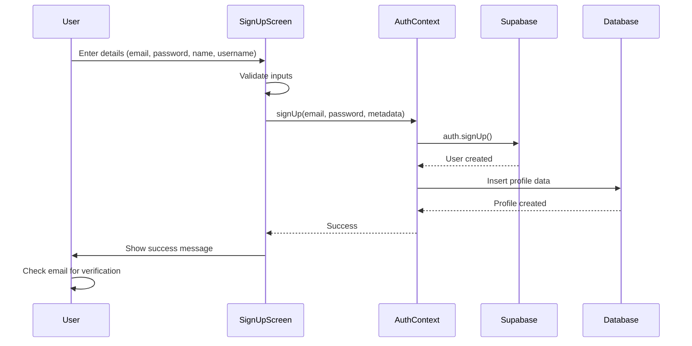
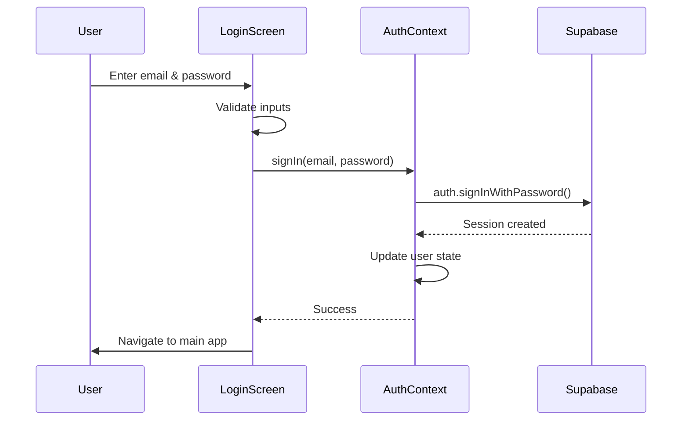
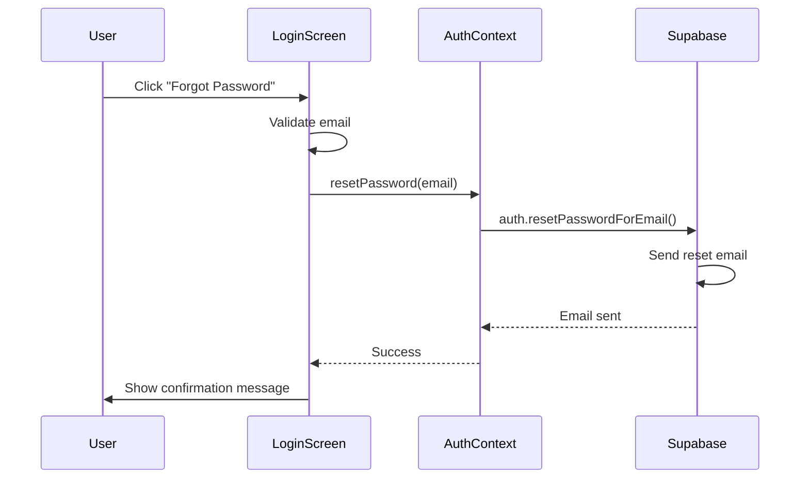

# StudyMate Authentication System Documentation

## Overview
StudyMate now has a fully functional, secure authentication system integrated with Supabase. This document covers the complete implementation including login, signup, email verification, password reset, and logout functionality.

## Features Implemented ✅

### 🔐 Core Authentication Features
- ✅ **Email + Password Sign Up** with comprehensive validation
- ✅ **Email + Password Sign In** with enhanced error handling
- ✅ **Email Verification** workflow with resend functionality  
- ✅ **Password Reset** via email
- ✅ **Secure Logout** with proper session cleanup
- ✅ **Persistent Authentication** state across app restarts

### 🎨 UI/UX Enhancements
- ✅ **Modern, Clean Interface** with StudyMate branding
- ✅ **Multi-Theme Support** (Light, Dark, AMOLED)
- ✅ **Loading States** with spinners and disabled buttons
- ✅ **Error Messages** with user-friendly formatting
- ✅ **Input Validation** with real-time feedback
- ✅ **Show/Hide Password** toggles
- ✅ **Icon Integration** with Lucide icons
- ✅ **Responsive Design** with proper keyboard handling

### 🛡️ Security Features
- ✅ **Input Validation** and sanitization
- ✅ **Password Strength Checking**
- ✅ **Email Format Validation**
- ✅ **Rate Limiting** protection
- ✅ **XSS Prevention**
- ✅ **Secure Error Handling**
- ✅ **Session Management**

### 🧭 Navigation & State Management
- ✅ **Protected Routes** with AuthGuard logic
- ✅ **Automatic Redirects** based on auth state
- ✅ **Drawer Integration** with user info and logout
- ✅ **Auth State Persistence** via AsyncStorage
- ✅ **Real-time Auth State** updates

## File Structure

```
StudyMate/
├── contexts/
│   ├── AuthContext.js          # Core authentication logic
│   └── ThemeContext.js         # Enhanced with auth colors
├── app/
│   └── auth/
│       ├── login.js           # Enhanced login screen
│       └── signup.js          # Enhanced signup screen
├── components/
│   ├── AuthGuard.js           # Route protection
│   └── DrawerContent.js       # Navigation with logout
├── utils/
│   ├── validation.js          # Input validation utilities
│   └── security.js            # Security utilities
├── lib/
│   └── supabase.js           # Supabase client configuration
└── config/
    └── api-config.js         # API configuration
```

## Authentication Flow

### 1. Sign Up Process


### 2. Sign In Process


### 3. Password Reset Process


## Key Components

### AuthContext (`contexts/AuthContext.js`)
The core authentication provider with the following methods:

```javascript
const {
  user,                    // Current user object
  profile,                 // User profile data
  loading,                 // Loading state
  signUp,                  // Sign up function
  signIn,                  // Sign in function
  signOut,                 // Sign out function
  resetPassword,           // Password reset function
  resendVerificationEmail, // Resend verification email
  updateProfile,           // Update user profile
  updateStudyPreferences,  // Update study preferences
  isAuthenticated,         // Check auth status
  getUserDisplayName,      // Get display name
  validateEmail,           // Email validation utility
  validatePassword         // Password validation utility
} = useAuth();
```

### Enhanced Login Screen (`app/auth/login.js`)
Features:
- Real-time input validation
- Enhanced error handling
- Password visibility toggle
- Theme-aware styling
- Loading states
- Forgot password functionality
- Email verification resend

### Enhanced Signup Screen (`app/auth/signup.js`)
Features:
- Comprehensive input validation
- Password strength checking
- Username availability
- Confirm password matching
- Enhanced UX with icons
- Theme integration
- Loading states

### Security Utilities (`utils/security.js`)
- `formatAuthError()` - User-friendly error messages
- `checkRateLimit()` - Prevent spam attempts
- `isDisposableEmail()` - Block temporary email services
- `sanitizeUserInput()` - Prevent XSS attacks
- `isWeakPassword()` - Check against common weak passwords
- `secureLogout()` - Secure logout with cleanup

### Validation Utilities (`utils/validation.js`)
- `validateEmail()` - RFC 5322 compliant email validation
- `validatePassword()` - Password strength validation
- `validateUsername()` - Username format validation
- `validateFullName()` - Name format validation
- `validateField()` - Generic field validation
- `validatePasswordMatch()` - Password confirmation
- `sanitizeInput()` - Input sanitization

## Usage Examples

### Using Authentication in Components

```javascript
import { useAuth } from '../contexts/AuthContext';

export default function MyComponent() {
  const { user, signOut, isAuthenticated } = useAuth();

  if (!isAuthenticated()) {
    return <Text>Please log in</Text>;
  }

  const handleLogout = async () => {
    const { error } = await signOut();
    if (error) {
      Alert.alert('Error', error);
    }
  };

  return (
    <View>
      <Text>Welcome, {user.email}!</Text>
      <Button title="Sign Out" onPress={handleLogout} />
    </View>
  );
}
```

### Input Validation Example

```javascript
import { validateEmail, validatePassword } from '../utils/validation';

const handleSubmit = () => {
  // Email validation
  if (!validateEmail(email)) {
    setError('Please enter a valid email address');
    return;
  }

  // Password validation
  const passwordCheck = validatePassword(password);
  if (!passwordCheck.isValid) {
    setError(passwordCheck.errors[0]);
    return;
  }

  // Proceed with authentication
};
```

## Configuration

### Supabase Setup
1. **Database URL**: Already configured in `lib/supabase.js`
2. **Anonymous Key**: Already configured in `lib/supabase.js`
3. **Email Settings**: Configure in Supabase dashboard
4. **RLS Policies**: Ensure proper Row Level Security

### Email Templates
Configure in Supabase dashboard:
- **Email Confirmation**: Custom template for email verification
- **Password Reset**: Custom template for password reset
- **Magic Link**: Custom template for magic link login (optional)

## Security Best Practices Implemented

### 1. Input Validation
- Email format validation (RFC 5322 compliant)
- Password strength requirements
- Username format restrictions
- Real-time validation feedback

### 2. Error Handling
- User-friendly error messages
- No sensitive information in errors
- Proper error categorization
- Rate limiting protection

### 3. Session Security
- Secure session storage via AsyncStorage
- Automatic session refresh
- Proper logout cleanup
- Auth state persistence

### 4. Data Protection
- Input sanitization to prevent XSS
- Protection against SQL injection
- Secure password handling
- Disposable email detection

## Testing the Authentication System

### Manual Testing Checklist

#### Sign Up Flow
- [ ] **Valid Registration**: Try registering with valid details
- [ ] **Email Verification**: Check email and verify account
- [ ] **Duplicate Email**: Try registering with existing email
- [ ] **Invalid Email**: Test with invalid email formats
- [ ] **Weak Password**: Test password strength validation
- [ ] **Password Mismatch**: Test confirm password validation
- [ ] **Loading States**: Verify loading indicators work

#### Sign In Flow
- [ ] **Valid Login**: Login with verified account
- [ ] **Invalid Credentials**: Test with wrong password
- [ ] **Unverified Email**: Test with unverified account
- [ ] **Non-existent Account**: Test with non-existent email
- [ ] **Forgot Password**: Test password reset flow
- [ ] **Resend Verification**: Test verification email resend

#### Navigation & State
- [ ] **Protected Routes**: Verify unauthenticated users redirect to login
- [ ] **Authentication Persistence**: Close and reopen app
- [ ] **Logout Function**: Test logout from drawer
- [ ] **Auto-redirect**: Verify authenticated users go to main app

#### Security Features
- [ ] **Rate Limiting**: Test multiple failed attempts
- [ ] **Input Validation**: Test all validation rules
- [ ] **XSS Prevention**: Test with malicious input
- [ ] **Theme Integration**: Test in all theme modes

## Troubleshooting

### Common Issues

#### 1. "Email not confirmed" Error
**Solution**: User needs to check email and click verification link
```javascript
// Handled automatically in login screen with resend option
const { error } = await resendVerificationEmail(email);
```

#### 2. "Invalid login credentials" Error
**Solution**: Check email and password, ensure account exists
```javascript
// Proper error formatting implemented in AuthContext
return { error: formatAuthError(error.message) };
```

#### 3. Network Connection Issues
**Solution**: Check internet connection and Supabase status
```javascript
// Automatic network error detection in security utilities
if (errorMessage.includes('network') || errorMessage.includes('connection')) {
  return 'Network error. Please check your internet connection and try again.';
}
```

#### 4. Profile Creation Fails
**Solution**: Check database permissions and RLS policies
```javascript
// Robust error handling in AuthContext
if (profileError) {
  console.error('Profile creation error:', profileError);
  return { error: 'Account created but profile setup failed. Please contact support.' };
}
```

## Performance Considerations

### Optimizations Implemented
1. **Lazy Loading**: Components load only when needed
2. **Efficient State Management**: Minimal re-renders
3. **Input Debouncing**: Real-time validation with debouncing
4. **Memory Management**: Proper cleanup of subscriptions
5. **Caching**: AsyncStorage for session persistence

### Best Practices
1. **Error Boundaries**: Implement for production use
2. **Loading States**: Always show user feedback
3. **Offline Support**: Consider implementing offline-first approach
4. **Analytics**: Add authentication event tracking
5. **Monitoring**: Monitor authentication success/failure rates

## Future Enhancements

### Potential Additions
1. **Social Login**: Google, Apple, Facebook integration
2. **Two-Factor Authentication**: SMS or app-based 2FA
3. **Biometric Login**: Fingerprint/Face ID support
4. **Account Linking**: Link multiple authentication methods
5. **Session Management**: Advanced session control
6. **Audit Logging**: Track authentication events

### Advanced Security Features
1. **Device Registration**: Register trusted devices
2. **Anomaly Detection**: Detect unusual login patterns
3. **Geo-location Verification**: Location-based security
4. **Password History**: Prevent password reuse
5. **Account Lockout**: Temporary lockout after failed attempts

## Support

For issues or questions regarding the authentication system:

1. **Check this documentation** for common solutions
2. **Review the code comments** in authentication files
3. **Check Supabase dashboard** for configuration issues
4. **Test in development environment** before production deployment

---

**Last Updated**: December 2024  
**Version**: 1.0.0  
**Status**: ✅ Production Ready